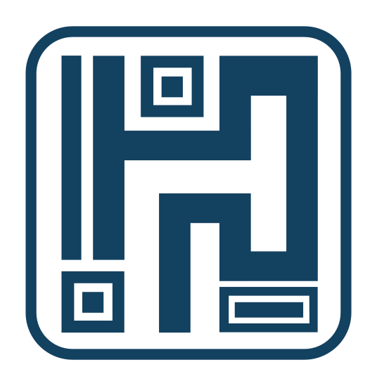
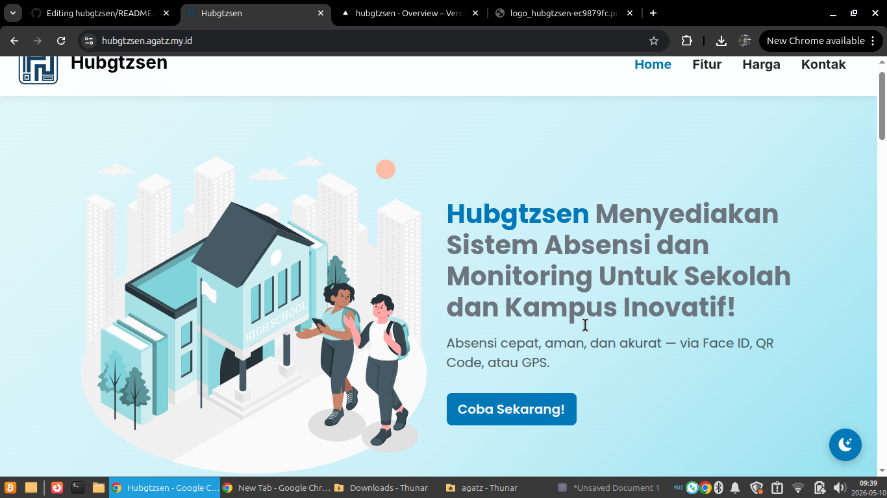
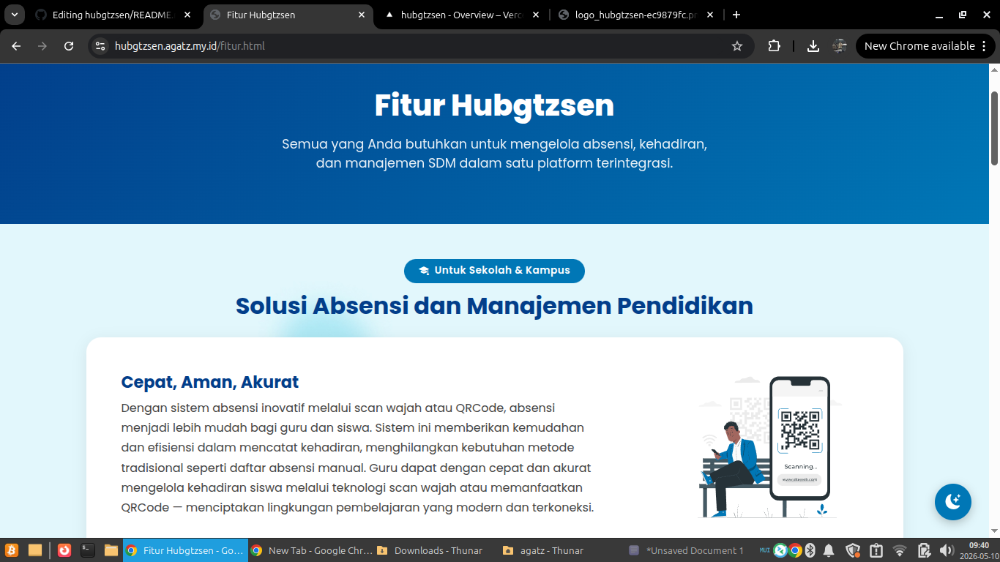
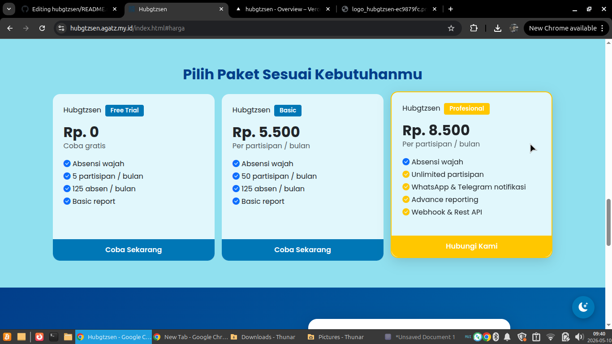

<div align="center">



# Hubgtzsen

**Sistem Absensi & Monitoring Modern untuk Sekolah, Kampus, dan Perkantoran**

[](https://hubgtzsen.agatz.my.id)
[](https://instagram.com/agatz.dev)
[]()

> 🎯 Absensi cepat, aman, dan akurat — via **Face ID**, **QR Code**, atau **GPS**

</div>

---

## 📸 Preview

<div align="center">

## 📸 Preview

<div align="center">

| Landing Page | Fitur Sekolah | Harga |
|:---:|:---:|:---:|
|  |  |  |

</div>

---

## ✨ Tentang Hubgtzsen

**Hubgtzsen** adalah platform manajemen absensi modern yang dikembangkan oleh **GTZCENTER**. Dirancang untuk memenuhi kebutuhan sekolah, kampus, dan perusahaan dengan teknologi terkini yang mudah digunakan oleh semua kalangan.

---

## 🚀 Fitur Utama

### 🏫 Untuk Sekolah & Kampus

| Fitur | Deskripsi |
|-------|-----------|
| 📷 **Absensi Wajah & QR Code** | Absensi via scan wajah atau QR Code — cepat, aman, dan akurat untuk guru maupun siswa |
| 📅 **Akses Jadwal Belajar** | Siswa dan guru dapat mengakses jadwal dan jurnal mengajar dengan mudah |
| 🔗 **Mudah Diintegrasikan** | Terhubung ke Moodle, e-Rapor, atau SIS via Open API |
| 📲 **Notifikasi Orang Tua** | Pemantauan realtime via WhatsApp & Email langsung ke orang tua |

### 🏢 Untuk Karyawan & HRD

| Fitur | Deskripsi |
|-------|-----------|
| 🕐 **Check In & Check Out** | Catat waktu kedatangan dan kepulangan via Face ID, QR Code, atau GPS |
| 📊 **Rekapan Kehadiran** | Pantau rekapan kehadiran bulanan karyawan secara transparan |
| 💰 **Perhitungan Salary** | Transparansi perhitungan gaji berbasis data presensi yang akurat |
| 📝 **Pengajuan Cuti** | Formulir pengajuan cuti digital yang efisien dan mudah dikelola |
| ✅ **Validasi Cuti oleh HRD** | Proses cuti lebih transparan dengan validasi langsung dari HRD |

---

## 💳 Paket Harga

<div align="center">

| | 🆓 Free Trial | 📦 Basic | ⭐ Profesional |
|---|:---:|:---:|:---:|
| **Harga** | Rp 0 | Rp 5.500 / orang / bulan | Rp 8.500 / orang / bulan |
| Absensi Wajah | ✅ | ✅ | ✅ |
| Partisipan | 5 / bulan | 50 / bulan | **Unlimited** |
| Absen / bulan | 125 | 125 | **Unlimited** |
| Laporan | Basic | Basic | **Advance** |
| Notifikasi WA & Telegram | ❌ | ❌ | ✅ |
| Webhook & REST API | ❌ | ❌ | ✅ |

</div>

> 💡 **Trial gratis 14 hari** tersedia untuk semua paket. Tidak perlu kartu kredit!

---

## 🛠️ Teknologi

Antarmuka web Hubgtzsen dibangun dengan:


---

## 📁 Struktur Proyek

```
hubgtzsen/
├── index.html          # Halaman utama
├── fitur.html          # Halaman detail fitur
├── style.css           # Stylesheet utama
├── script.js           # JavaScript (form, dark mode, scroll)
└── img/
    ├── logo_hubgtzsen-ec9879fc.svg
    ├── logo_hubgtzsen-ec9879fc.png
    ├── High School-amico.svg
    ├── school.svg
    ├── qr-school.svg
    ├── schedule.svg
    ├── integration.svg
    ├── message.svg
    ├── qr office.svg
    ├── archive.svg
    ├── calculate.svg
    ├── form.svg
    ├── verifed.svg
    └── instagram.png
```

---

## ⚡ Cara Menjalankan (Development)

```bash
# Clone repositori
git clone https://github.com/username/hubgtzsen.git

# Masuk ke direktori
cd hubgtzsen

# Buka dengan live server (VS Code extension) atau:
npx serve .
```

> Tidak ada dependency tambahan — murni HTML, CSS, dan JavaScript vanilla dengan Bootstrap CDN.

---

## 📬 Kontak & Demo

Tertarik mencoba **Hubgtzsen**? Tim kami siap membantu!

- 🌐 **Website:** [hubgtzsen.agatz.my.id](https://hubgtzsen.agatz.my.id)
- 📸 **Instagram:** [@agatz.dev](https://instagram.com/agatz.dev)

---

## 🌙 Fitur Tambahan

- **Dark Mode** — Toggle dark/light mode yang tersimpan otomatis
- **Responsive Design** — Tampilan optimal di semua ukuran layar
- **SEO Friendly** — Meta tags lengkap untuk Open Graph & Twitter Card
- **Aksesibilitas** — ARIA labels pada seluruh elemen navigasi dan form

---

<div align="center">

**Dibuat dengan ❤️ oleh [AGATZ](https://hubgtzsen.agatz.my.id)**

Copyright © 2026 — AGATZ | All Rights Reserved

</div>
